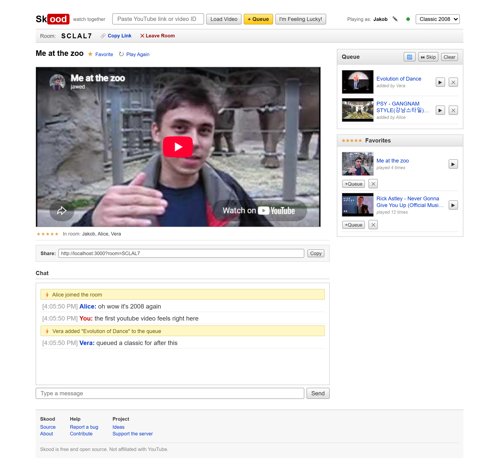
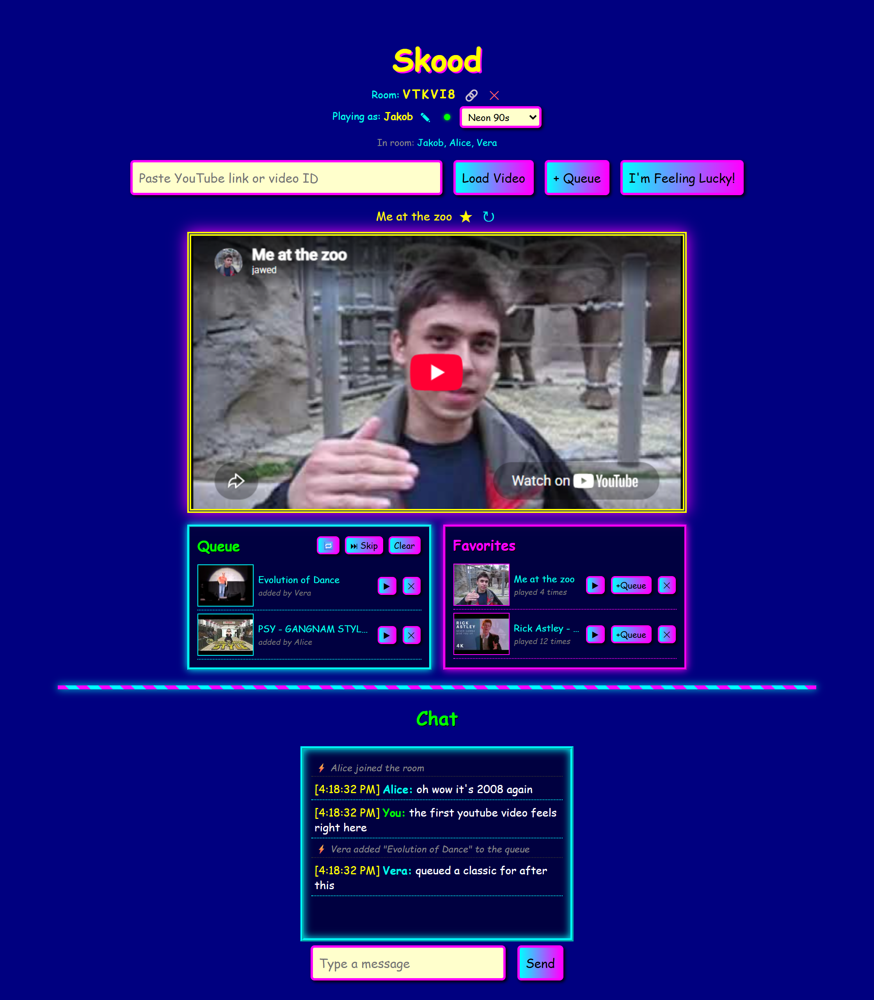
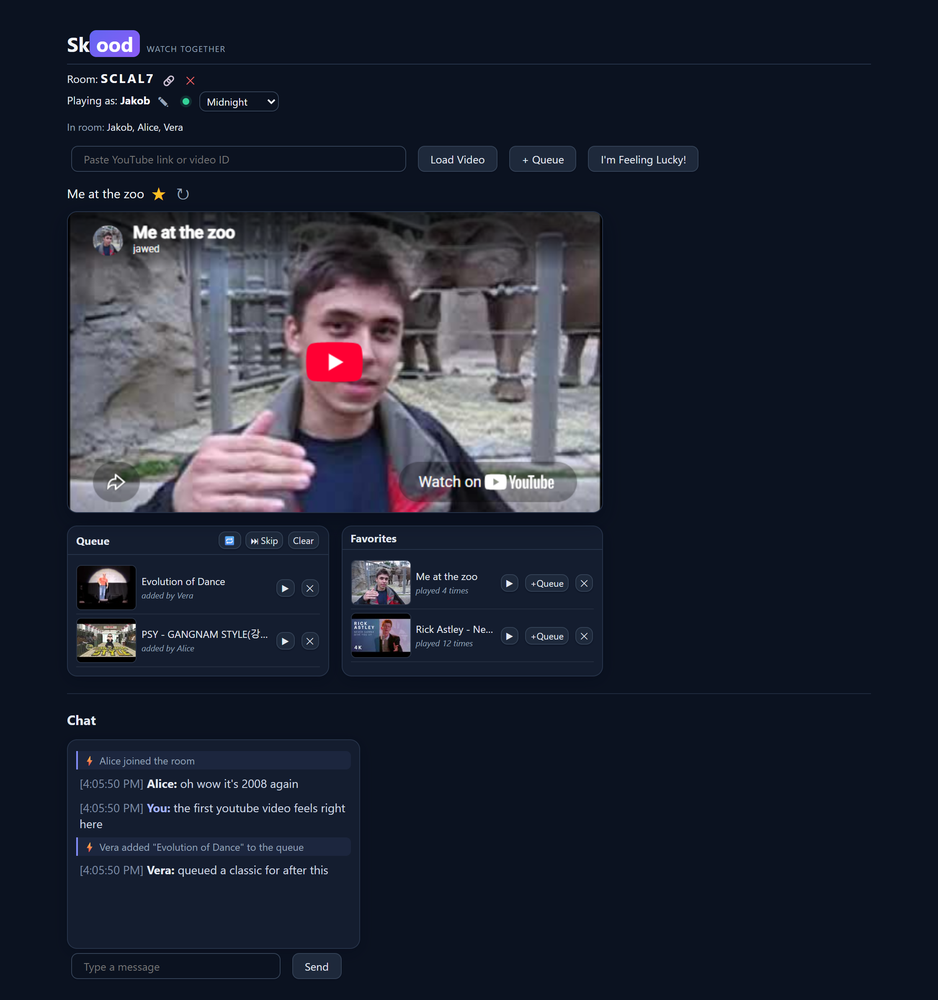

<div align="center">

# Skood

**Watch YouTube together in perfectly synced rooms, wearing its best 2008 outfit.**

[](LICENSE)
[](package.json)
[](https://github.com/7akob/skood-2-g/actions/workflows/ci.yml)
[](CONTRIBUTING.md)



### Try it now at [skood.jkb.app](https://skood.jkb.app)

*No account, no install. Create a room and share the link.*
*(Community instance on a small box; if it's ever busy, self-hosting is two commands.)*

</div>

## Why Skood

Skood exists because watching a video together shouldn't require an account, a subscription nag, or a page fighting your ad blocker. Every watch-together site I tried had some of that: paywalled features, heavy ads, trackers, or videos that refused to play. So I built the opposite, and it's been in weekly use for movie nights over Discord for about a year. It started as one shared session for my friend group; rooms came later so that any number of groups can use it at the same time. It also does great projected on a wall at parties.

What "the opposite" means in practice:

- No ads and no trackers of its own. Nothing breaks if you run an ad blocker, because there is nothing to block. Whatever YouTube does inside its own player is untouched.
- No accounts. Pick a name and you're in.
- No database. Rooms live in the server's memory and evaporate when the last person leaves. There is nothing to breach, sell, or subpoena.
- No lock-in. MIT licensed, a server that fits in 260 lines, self-hostable in two commands. It stays free.

*Skood comes from the Swedish "skåda", to watch.*

## Features

- Synced playback: play, pause and seek follow everyone in the room. The server keeps the authoritative position, so late joiners land exactly where the room is instead of at 0:00.
- Shareable rooms: six-character codes and `?room=CODE` deep links with one-click copy.
- Shared queue with thumbnails, titles and "added by" attribution. Play now, skip, clear, and auto-advance when a video ends.
- Loading a video never yanks the screen away from the room: if something is already playing, it joins the queue instead. Interrupting is still possible, but only through actions that are deliberate and announced in chat.
- Loop toggle, shared by the whole room.
- Favorites with play counts, stored in your browser rather than the room.
- "I'm Feeling Lucky" pulls a random favorite the room hasn't watched yet, for when nobody can decide. It queues rather than interrupting, unless nothing is playing.
- Presence and chat: a live list of who's in the room, join/leave/rename notices, and an ephemeral room chat.
- Installable as a PWA, and your lock screen media controls drive the shared room state.
- Three themes, remembered per browser.

## Themes

| Classic 2008 *(default)* | Neon 90s | Midnight |
| :---: | :---: | :---: |
|  |  |  |

Switch anytime with the selector in the lobby or the room. All three are the same HTML: Classic 2008 rebuilds it into a period watch page, with a masthead search bar, a nav strip, related-video style sidebar modules and a footer, using CSS grid areas rather than different markup. Adding your own theme is a small diff (see [CONTRIBUTING.md](CONTRIBUTING.md)), and [the theme gallery issue](https://github.com/7akob/skood-2-g/issues/2) has a ready-designed light theme waiting for a first contributor.

## Quick start

```bash
git clone https://github.com/7akob/skood-2-g.git
cd skood-2-g
npm install
npm start
```

Open <http://localhost:3000>, create a room, and share the link. That's the whole setup: the YouTube IFrame player, title lookup and thumbnails are all keyless public endpoints.

### Docker

```bash
docker compose up -d --build
```

The bundled `docker-compose.yml` binds to `127.0.0.1:3000` on purpose: it expects to sit behind a reverse proxy on your server. Change the port mapping if you want it exposed directly.

## Deploying

Two things matter when you put Skood behind a reverse proxy:

1. WebSockets must be forwarded. Skood uses the WebSocket transport only, with no HTTP long-polling fallback, so a proxy that doesn't forward upgrade headers breaks it completely.
2. Rooms live in memory. A restart clears them and there is nothing to back up. Run a single instance.

**Caddy** (handles WebSockets automatically):

```text
skood.example.com {
    reverse_proxy localhost:3000
}
```

**nginx:**

```nginx
location / {
    proxy_pass http://127.0.0.1:3000;
    proxy_http_version 1.1;
    proxy_set_header Upgrade $http_upgrade;
    proxy_set_header Connection "upgrade";
    proxy_set_header Host $host;
}
```

## How it works

The whole app is five files. An Express + Socket.IO server (`server.js`, around 260 lines) keeps a per-room state object entirely in memory: `{ videoId, time, isPlaying, loop }` plus the queue and presence. Every play, pause and seek updates it and is broadcast to the room. When someone joins or reconnects, the server extrapolates the current position from the last update timestamp, so they sync to where the room actually is. When the last person leaves, the room evaporates.

The client (`public/`) is vanilla HTML, CSS and JavaScript driving the official YouTube IFrame player. No framework, no bundler, no transpiler. What's in the repo is what ships. Favorites and your username stay in `localStorage`; nothing about you is stored server-side.

Design goals, in order: cheap to run on a free tier, trivial to self-host, easy to read in one sitting.

## Privacy

The "no tracking" claim is verifiable, since the code is one sitting long. The full inventory:

- What the server holds: the live room object only. Room code, current video ID and position, the queue, and the names people typed. In memory, never written to disk, deleted the moment the last person leaves.
- What your browser stores: your username, favorites and theme choice, in `localStorage`. Clear site data and they're gone.
- What's counted: the lobby shows how many rooms are open right now. That is the server reporting the size of its own in-memory list. No names, no history, no storage behind it.
- What doesn't exist: cookies, analytics, fingerprinting, and logs of what anyone watched.

## FAQ

**Will YouTube block this?**
Unlikely. Skood is a plain, by-the-book embed. It uses the official YouTube IFrame Player API, and every viewer streams directly from YouTube in their own player: views count, region rules apply, and YouTube's own embed behavior is untouched. Nothing is proxied, downloaded or stripped, so there is nothing to crack down on.

**Why do some videos refuse to play ("not allowed on other sites")?**
The uploader or their label disabled embedding for that video. It affects every embed on the web equally. Skood just tells you in chat instead of showing a silently dead player.

**Everyone drifted apart for a moment. Why?**
If YouTube serves one viewer an ad inside the embed, that person's clock differs until it ends. A pause and play from anyone, or refocusing the tab, resyncs the room.

**Is it really free?**
Yes. Free to use at [skood.jkb.app](https://skood.jkb.app), free to self-host, MIT licensed. The project takes no profit; see [Support](#support) for how the running costs are handled.

## Feedback and contributing

- Something broke? [File a bug](https://github.com/7akob/skood-2-g/issues/new?template=bug_report.yml). Takes two minutes.
- Missing a feature? [Suggest it](https://github.com/7akob/skood-2-g/issues/new?template=feature_request.yml).
- Do frontend or UX work? This is the part of Skood that needs help most. [Issue #4](https://github.com/7akob/skood-2-g/issues/4) lists the rough edges I already know about, from the blocking browser dialogs to the missing accessibility pass, each one small enough for a single pull request.
- Want to add a theme? [The theme gallery](https://github.com/7akob/skood-2-g/issues/2) walks you through it, and a designed but unbuilt light theme is up for grabs.
- Want to hack on it? Start with [CONTRIBUTING.md](CONTRIBUTING.md) and the [`help wanted`](https://github.com/7akob/skood-2-g/issues?q=is%3Aissue+is%3Aopen+label%3A%22help+wanted%22) and [`good first issue`](https://github.com/7akob/skood-2-g/issues?q=is%3Aissue+is%3Aopen+label%3A%22good+first+issue%22) labels.

The one rule: it stays vanilla. No frameworks, no build step, no database, no API keys.

## License

[MIT](LICENSE) © [Jakob (7akob)](https://github.com/7akob)

## Support

I have a day job and Skood doesn't need donations. The app is MIT licensed, carries no ads, and is never going to make money on purpose. What does exist is a small infrastructure bill for the public instance:

| What | Cost |
| --- | --- |
| VPS (shared with my other projects) | about 5 € per month |
| Domain | about 5 € per year |

If you'd like to help carry that, there is a [Buy Me a Coffee page](https://buymeacoffee.com/7akob). Everything contributed goes to the server and the domain, contributions are public on that page, and if they ever exceed the bills, the numbers and where the surplus went will be documented right here in this section. Starring the repo or showing a friend helps at least as much.
